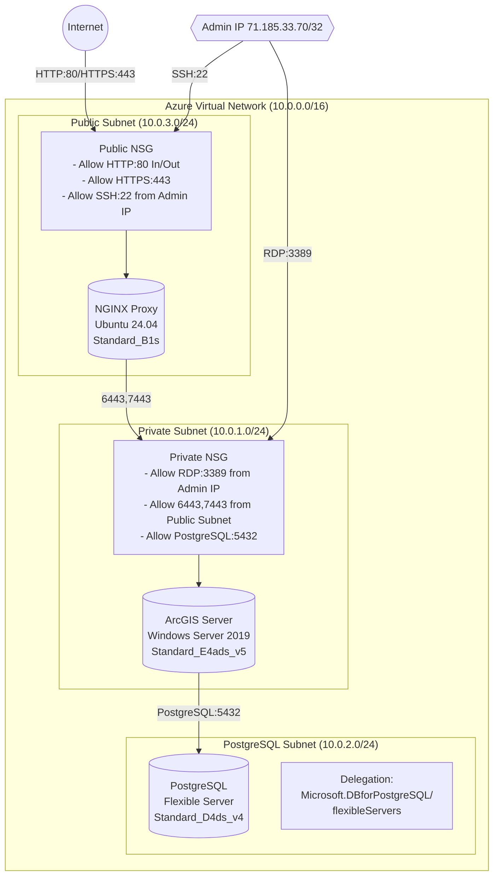

# Azure Enterprise Network Documentation
## Overview
This environment represents a secure, multi-tier architecture designed for an ArcGIS deployment in Azure, featuring public-facing services, private application tier, and a dedicated database subnet.

## Network Architecture
### Virtual Network

- Name: arcgis-vnet
- Address Space: 10.0.0.0/16
- Region: East US 2
- Resource Group: gis

### Subnet Configuration

- Public Subnet (10.0.3.0/24)
    - Purpose: Hosts public-facing NGINX proxy
    - NSG: nginx-nsg

- Private Subnet (10.0.1.0/24)
    - Purpose: Hosts ArcGIS Server components 
    - NSG: arcgis-nsg

- PostgreSQL Subnet (10.0.2.0/24)
    - Purpose: Dedicated subnet for PostgreSQL Flexible Server
    - Delegation: Microsoft.DBforPostgreSQL/flexibleServers
    - Access: Restricted to admin IP and private subnet
    - NSG: arcgis-nsg

### Security Configuration
#### Access Controls

- Admin Access: Limited to specific IP (71.185.33.70/32)
- Network Isolation: Three-tier architecture with public, private, and database layers
- Service Access:
    - Public access only to NGINX proxy
    - Internal services accessible only through private network

### Network Security Groups (NSGs)

#### Public NSG (nginx-nsg)
- Priority 100: Allow HTTPS (80) from Any
- Priority 110: Allow SSH (22) from Admin IP
- Priority 120: Allow HTTPS (443) from Any

#### Private NSG (arcgis-nsg)
- Priority 100: Allow RDP (3389) from Admin IP
- Priority 110: Allow PostgreSQL (5432) from Admin IP
- Priority 120: Allow Portal/Server (6443, 7443) from Public Subnet

### Network Flow

- External users access the application through HTTPS (443) to the NGINX proxy
- NGINX proxy forwards requests to ArcGIS Server/Portal (6443, 7443)
- ArcGIS components communicate with PostgreSQL database on port 5432
- Administrative access is strictly controlled through dedicated IP

## Virtual Machine Specifications:

- NGINX Proxy: Ubuntu 24.04 LTS on Standard_B1s
- ArcGIS Server/Portal: Windows Server 2019 on Standard_E4ads_v5
- PostgreSQL: Standard_D4ds_v4 Flexible Server

## ArcGIS Server/Portal Configuration:

## Database Configuration:

- PostgreSQL Flexible Server with PostGIS extension enabled
- Premium storage with 128GB and 6000 IOPS
- Network access through private endpoint
- High availability disabled

## Backup:

Recovery Services vault (defaultVault219) is configured for `dvrpcgis-enterprise` VM:

- Default daily backup policy
- Enhanced policy with 4-hour intervals
- 30-day retention period

DB Azure Database for PostgreSQL - Flexible Server:
- 7-day retention period

## Best Practices Implemented

- Network segmentation using separate subnets
- Database delegation for managed service optimization
- Public access limited to necessary ports
- Administrative access restricted by IP

This environment follows Azure's recommended security practices while providing the necessary infrastructure for an enterprise GIS deployment.

# Azure Network Architecture

